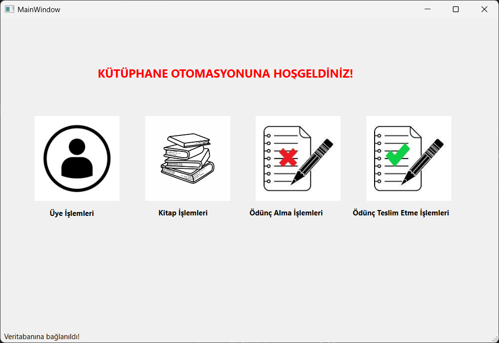
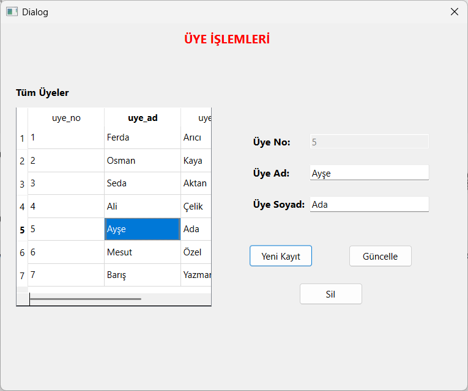
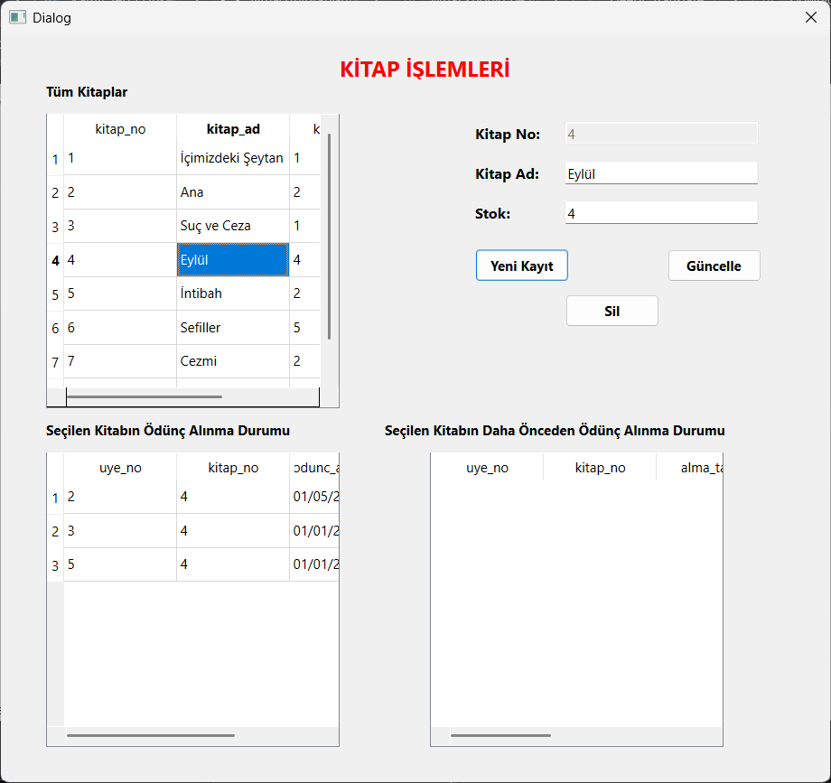
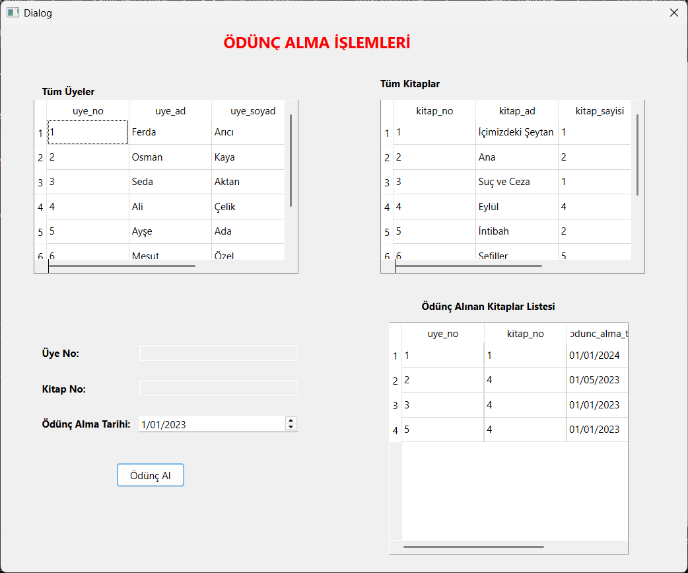
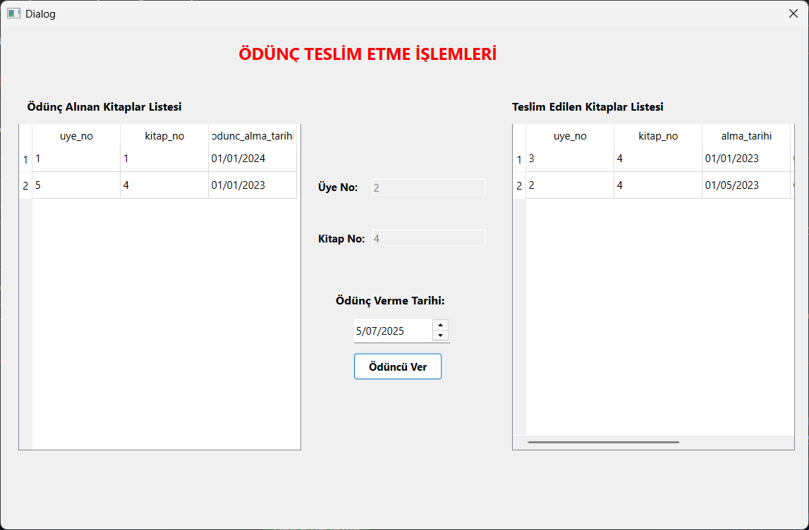

# 📚 Library Management System (Qt C++)

This is a desktop library automation application developed using Qt 6.6.3 and C++.  
It allows you to manage library members, books, borrow and return transactions through an interactive and user-friendly GUI.

---

## 🎯 Features

- 📋 Member Management (Add, Update, Delete, List)
- 📚 Book Management (Add, Update, Delete, Stock Tracking)
- 🔄 Borrow / Return book operations with dates
- 💾 SQLite database support
- 👁️ Data views using `QSqlQueryModel`
- 🎨 Interface designed using Qt Designer

---

## 🖼️ Screenshots

<table>
  <tr>
    <td align="center">
      <strong>🏠 Main Menu</strong><br/>
      
    </td>
    <td align="center">
      <strong>👥 Member Management</strong><br/>
      
    </td>
  </tr>
  <tr>
    <td align="center">
      <strong>📚 Book Management</strong><br/>
      
    </td>
    <td align="center">
      <strong>📥 Borrow Book</strong><br/>
      
    </td>
  </tr>
  <tr>
    <td align="center" colspan="2">
      <strong>📤 Return Book</strong><br/>
      
    </td>
  </tr>
</table>


---

## ⚙️ Technologies Used

- Qt 6.6.3 (MinGW 64-bit)
- C++17
- SQLite
- Qt Designer (`.ui` files)
- Qt Creator IDE

---

## 🚀 Build Instructions

### Requirements:
- Qt 6.6.3 or compatible version
- Qt Creator IDE
- qmake or CMake (qmake used)

### Steps:
```bash
git clone https://github.com/lymac0/library-management-system.git
cd library-management-system
```

1. Open `library-management-system.pro` in Qt Creator.
2. Choose the Kit: `Desktop Qt 6.6.3 MinGW 64-bit`.
3. Build & Run the project.

---

## 📁 Project Structure

```
library-management-system/
├── images/               # Icons used in the UI
├── screenshots/          # Screenshots for README
├── *.cpp / *.h           # Source code files
├── *.ui                  # UI design files
├── library-management-system.pro
├── .gitignore
└── README.md
```

---
